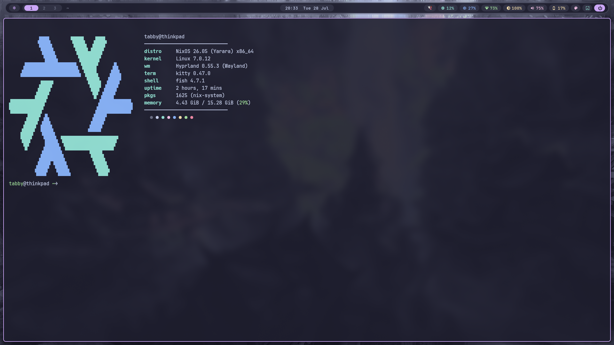
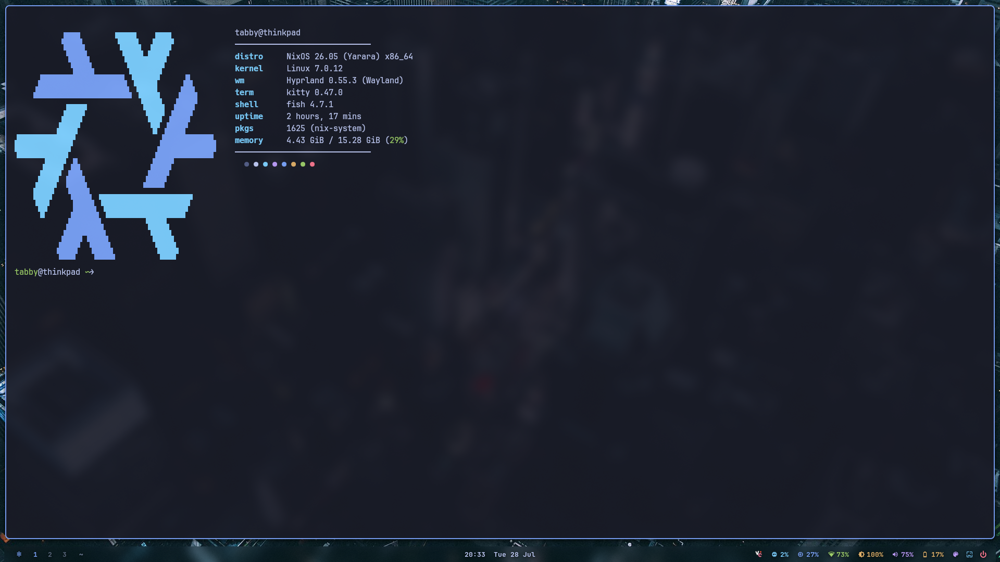
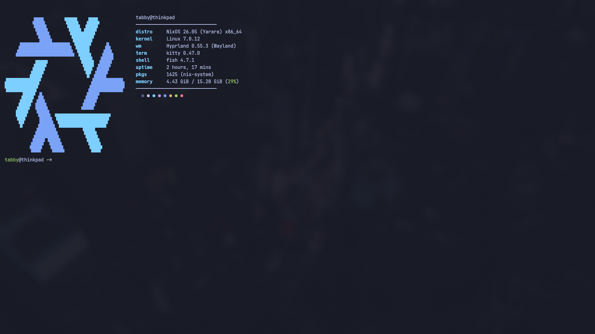

<div align="center">

```
                        ╱|、
                        (˚ˎ 。7
                        |、˜〵
                        じしˍ,)ノ


       _        _     _                  _
      | |_ __ _| |__ | |__  _   _   _ __(_) ___ ___
      | __/ _` | '_ \| '_ \| | | | | '__| |/ __/ _ \
      | || (_| | |_) | |_) | |_| | | |  | | (_|  __/
       \__\__,_|_.__/|_.__/ \__, | |_|  |_|\___\___|
                            |___/
```

**a hyprland desktop that themes itself, animates its wallpapers, and reshapes its bar on a keypress**

<br>

`7 themes`&nbsp;&nbsp;·&nbsp;&nbsp;`4 bar styles`&nbsp;&nbsp;·&nbsp;&nbsp;`live wallpaper engine`&nbsp;&nbsp;·&nbsp;&nbsp;`one-command install`

<br>


</div>

<br>

---

<br>

<div align="center">

### the four faces

</div>

|  |  |
|:---:|:---:|
|  |  |
| **petal** — floating islands · graphite | **pills** — bubbly capsules · mocha |
|  |  |
| **ghost** — the bar dissolves into the wall · tokyo night | the fastfetch splash |

<br>

## what makes it tick

🎨 &nbsp; **one keypress, everything recolors.** Hyprland, waybar, kitty (live, no restart), rofi, mako, and starship all switch together across seven palettes — graphite, catppuccin mocha and latte, tokyo night, rosé pine, gruvbox, and nord.

🖼️ &nbsp; **wallpapers follow your theme.** A rofi thumbnail grid lets you pick per-theme, global, or from everything, with transitions that ripple out from your cursor. Change theme and a matching wallpaper comes with it.

📊 &nbsp; **the bar has four personalities.** Floating petal islands, bubbly pills, a flat classic bar, or ghost — no bar at all, just text drifting on the wallpaper. Top or bottom, on any monitor.

🖥️ &nbsp; **a wizard sets up your monitors.** It reads your real displays, defaults each to its highest refresh rate, and asks for order, scale, and alignment. Dual setups get workspaces pinned automatically.

🟢 &nbsp; **NVIDIA-smooth out of the box.** Anti-flicker settings are baked in — no hardware cursors, static borders, VRR off — so you skip the evening of chasing flicker.

<br>

## install

```bash
git clone https://github.com/glaceyawn/tabby-rice
cd tabby-rice
./install.sh
```

The installer detects your distro and installs packages the right way for each:

| your distro | how it installs |
|---|---|
| Arch · CachyOS · EndeavourOS · Manjaro | `pacman`, automatically |
| Fedora | `dnf`, automatically |
| Debian 13+ · Ubuntu 24.10+ | `apt`, automatically |
| NixOS | prints the config snippet to paste |
| anything else | lists the packages, then installs the configs |

Anything you already have is skipped. Your current setup is backed up to `~/.config/rice-backup-<timestamp>/` before a single file moves. Run `./install.sh --check` first if you just want to see what's missing.

<br>

## the map

```
tabby-rice
├── install.sh                      the one script you run
└── home/
    └── .config/
        ├── hypr/
        │   ├── hyprland.conf        keybinds, rules, the whole compositor
        │   ├── monitors.conf        written by the monitor wizard
        │   └── colors.conf          written by theme-switch
        ├── waybar/
        │   ├── config.jsonc         what appears on the bar
        │   └── styles/
        │       ├── petal.css
        │       ├── pills.css        the four bar faces
        │       ├── flat.css
        │       └── ghost.css
        ├── rofi/  kitty/  mako/  fastfetch/  fish/
        ├── theme-engine/
        │   ├── themes/              7 palettes — drop your own here
        │   └── templates/
        └── starship.toml            all 7 palettes embedded

    home/.local/bin/
        ├── theme-switch             the heart — recolors everything
        ├── wall  wall-fetch         wallpaper picker and downloader
        ├── bar-switch               swap bar style and position
        ├── bar-monitor              put the bar on a chosen screen
        └── rice-welcome             the help panel
```

<br>

## keybinds

Everything runs on the **Super** key (the Windows key). Press **Super + Shift + H** anytime to see this as a panel on your desktop.

**the rice**

| key | action |
|---|---|
| Super + F2 | switch theme |
| Super + F3 | wallpaper picker (add Shift for random) |
| Super + F4 | bar style and position (add Shift for which monitor) |
| Super + Shift + H | open the help panel |

**apps**

| key | action |
|---|---|
| Super + Space | app launcher |
| Super + B / T / N / E | firefox · terminal · neovim · files |
| Super + S | dropdown terminal |
| Super + C | clipboard history |

**windows**

| key | action |
|---|---|
| Super + Q / V / F | close · float · fullscreen |
| Super + arrow keys | move focus (add Shift to move the window) |
| Super + 1-9 | switch workspace |

**system**

| key | action |
|---|---|
| Super + W | dismiss notification (Shift for all, Ctrl to restore) |
| Super + F1 | do-not-disturb |
| Super + L | lock screen |
| Super + Shift + S | region screenshot |
| media keys | volume and brightness |

<br>

## make it yours

**a new theme** — drop a 14-line palette file in `theme-engine/themes/yours.sh`, add a matching `[palettes.yours]` block to `starship.toml`, and it shows up in the switcher.

**a bar tweak** — edit the files in `waybar/styles/`, never `style.css` (that one gets overwritten every time you switch styles).

**per-theme wallpapers** — drop images into `~/Pictures/wallpapers/<theme>/` and they join the rotation.

<br>

<details>
<summary><b>how the theme engine actually works</b></summary>

<br>

Every app reads its colors from a small generated include file. One script, `theme-switch`, is the only thing that writes them. When you switch, it regenerates every include from a palette, renders mako from a template, flips starship's palette, live-recolors each open kitty over its control socket, pulls a matching wallpaper, and reloads the compositor. That is why the change is instant and total instead of app-by-app. Adding a theme is genuinely just the two files above — the engine scans the folder.

</details>

<br>

## credits

Wallpapers are fetched by `wall-fetch` from these collections (not redistributed here — each keeps its own license):
[orangci](https://github.com/orangci/walls-catppuccin-mocha) · [zhichaoh](https://github.com/zhichaoh/catppuccin-wallpapers) · [dharmx](https://github.com/dharmx/walls) · [rose-pine](https://github.com/rose-pine/wallpapers) · [AngelJumbo](https://github.com/AngelJumbo/gruvbox-wallpapers) · [linuxdotexe](https://github.com/linuxdotexe/nordic-wallpapers) · [D3Ext](https://github.com/D3Ext/aesthetic-wallpapers)

Palettes: [catppuccin](https://catppuccin.com) · [tokyo night](https://github.com/folke/tokyonight.nvim) · [rosé pine](https://rosepinetheme.com) · [gruvbox](https://github.com/morhetz/gruvbox) · [nord](https://nordtheme.com)

<br>

<div align="center">

```
   ╱|、
  (˚ˎ 。7
   |、˜〵
   じしˍ,)ノ
```

**MIT** &nbsp;·&nbsp; made by [tabby](https://tabby.beauty)

</div>
